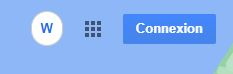
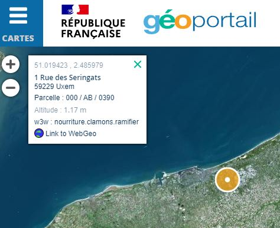
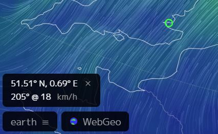
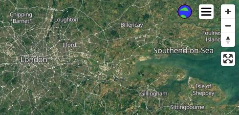
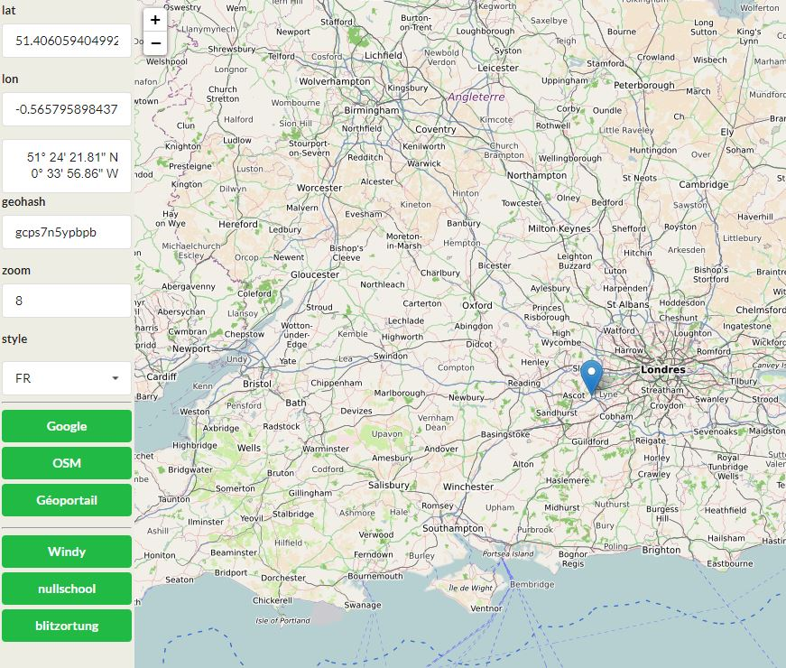

# webgeo extension

**webgeo extension** is an extension to navigate from and to various mapping websites (google maps, openstreetmap, geoportail, nullschool, blitzortung, webgeo) using WebGeo as hub to navigate from one to another.

## on Google maps

## on OpenStreetMap

## on Geoportail

## on Nullschool

## on Blitzortung

## on WebGeo

WebGeo natively support links to other sites. This extension doesn't change WebGeo.

