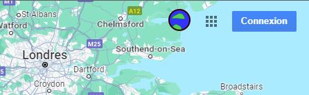
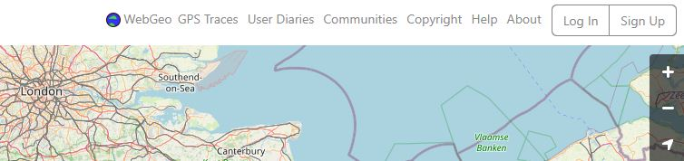
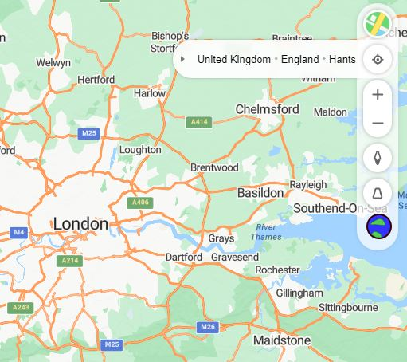
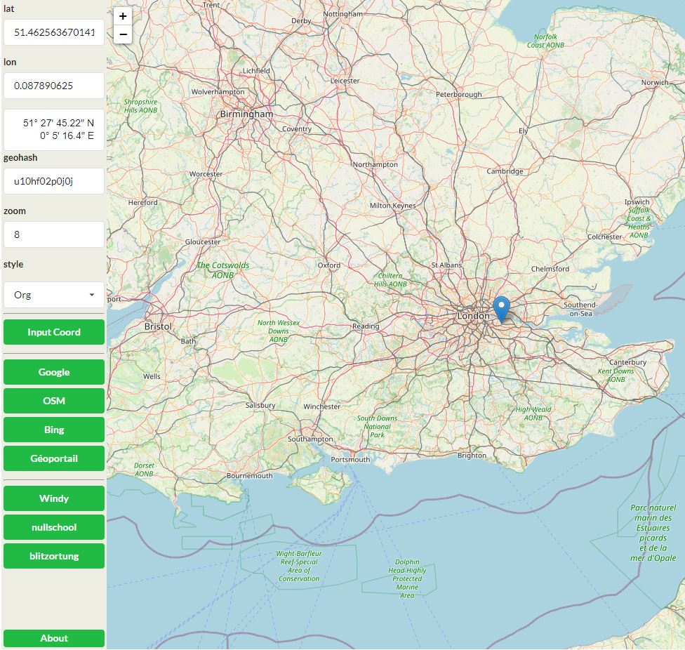

# webgeo extension

**webgeo extension** is an extension to navigate from and to various mapping websites (google maps, openstreetmap, bing maps, geoportail, nullschool, blitzortung, webgeo) using WebGeo ( https://webgiss.github.io/webgeo/ ) as hub to navigate from one to another.

Links:
* **project** : https://github.com/webgiss/webgeo-extension
* **chrome store** : Not yet accepted

## on Google maps

## on OpenStreetMap

## on BingMaps

## on Geoportail

## on Nullschool

## on Blitzortung

## on WebGeo

WebGeo natively support links to other sites. This extension doesn't change WebGeo.

